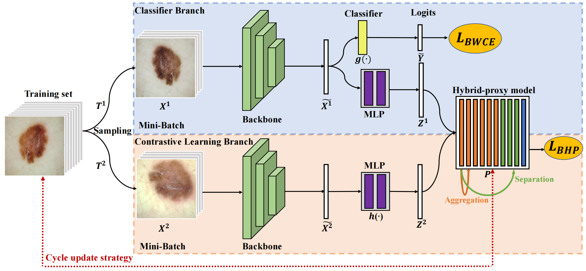

<div align="center">

<h1>ECL: Class-Enhancement Contrastive Learning for Long-tailed Skin Lesion Classification</h1>


[](https://opensource.org/licenses/mit-license.php)

</div>

### Share us a :star: if this repo does help

This repository is the official implementation of *ECL* ***(Accepted by MICCAI 2023)***. If you encounter any question, please feel free to contact us. You can create an issue or just send email to me zhangyilan@buaa.edu.com. Also welcome for any idea exchange and discussion.

## Updates

[**07/09/2023**] Code is public.

## Table of Contents

- [Abstract](#Abstract)
- [Requirements](#Requirements)
- [Datasets](#Datasets)
- [Training](#Training)
- [Citation & Acknowledgments](#Citation-&-Acknowledgments)
- [License](#License)

## Abstract

Skin image datasets often suffer from imbalanced data distribution, exacerbating the difficulty of computer-aided skin disease diagnosis.  Some recent works exploit supervised contrastive learning (SCL) for this long-tailed challenge. Despite achieving significant performance, these SCL-based methods focus more on head classes, yet ignore the utilization of information in tail classes. In this paper, we propose class-*E*nhancement *C*ontrastive *L*earning (*ECL*), which enriches the information of minority classes and treats different classes equally. For information enhancement, we design a hybrid-proxy model to generate class-dependent proxies and propose a cycle update strategy for parameter optimization. A balanced-hybrid-proxy loss is designed to exploit relations between samples and proxies with different classes treated equally. Taking both "imbalanced data" and "imbalanced diagnosis difficulty" into account, we further present a balanced-weighted cross-entropy loss following the curriculum learning schedule.

## Presentation

https://github.com/zylbuaa/ECL/assets/90943537/6aca9f12-aac3-47f1-832a-140e0939f049

## Requirements
- Windows/Linux both support
- python 3.8
- PyTorch 1.9.0
- torchvision 0.10.0

## Datasets
We conduct experiments on two public skin lesion datasets (download from [ISIC Challenge](https://challenge.isic-archive.com/)): ISIC 2018 and ISIC 2019. The ISIC 2018 dataset contains 2594 images of 7 classes, and the ISIC 2019 dataset contains 25331 images of 8 classes.
You can run the following code to get the splied datasets:
```python
python ./utils/dataset/split_data.py  --datapath ./data/ISIC2018/ --dataset ISIC2018
```

## Training
To train the model(s) in the paper, run this command:
```python
python train.py --dataset ISIC2018 --data_path ./data/ISIC2018/ --batch_size 64 --lr 0.002 --epochs 100 --gpu 0 --model_path ./results/ISIC2018/
```

## Citation & Acknowledgments

If you find this repo useful for your research, please consider citing the paper


## License
This project is released under the [MIT license](LICENSE).
